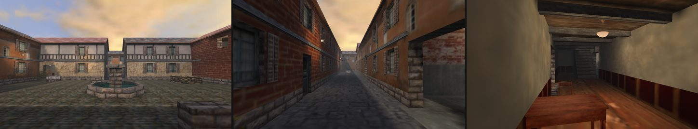
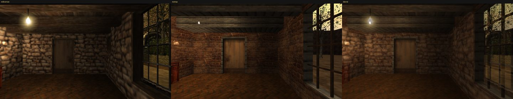
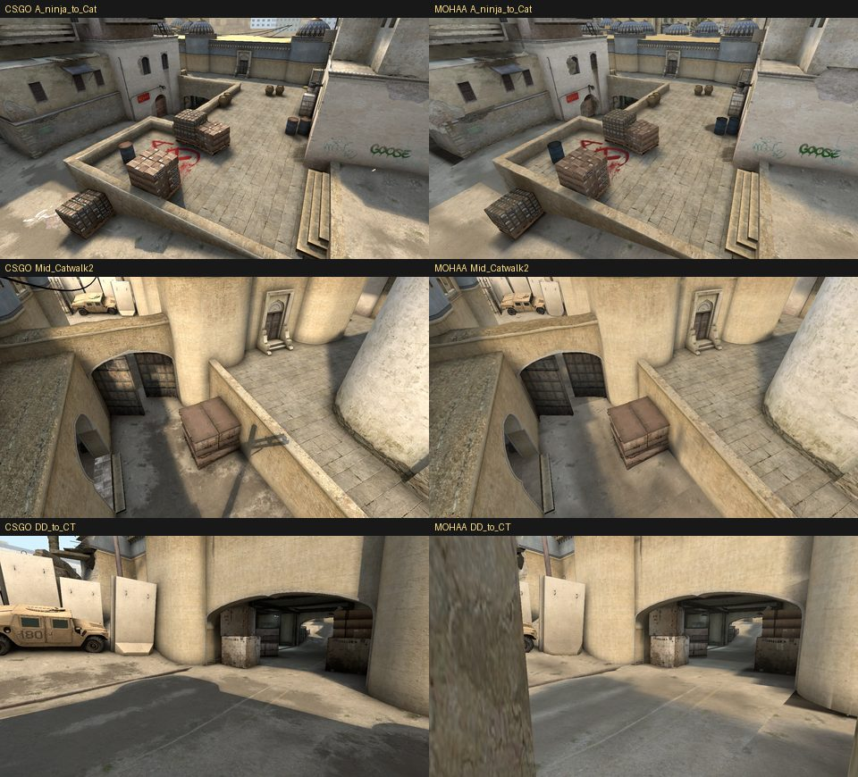
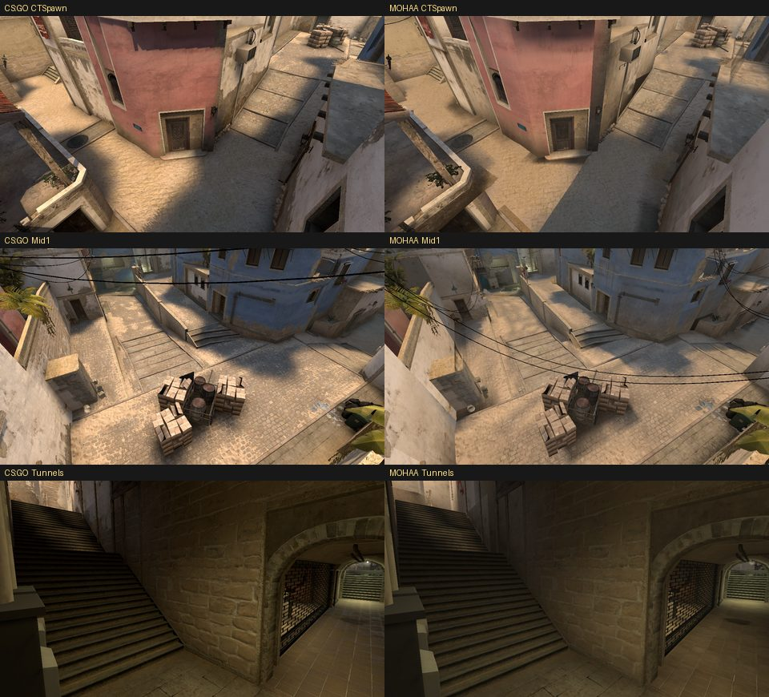
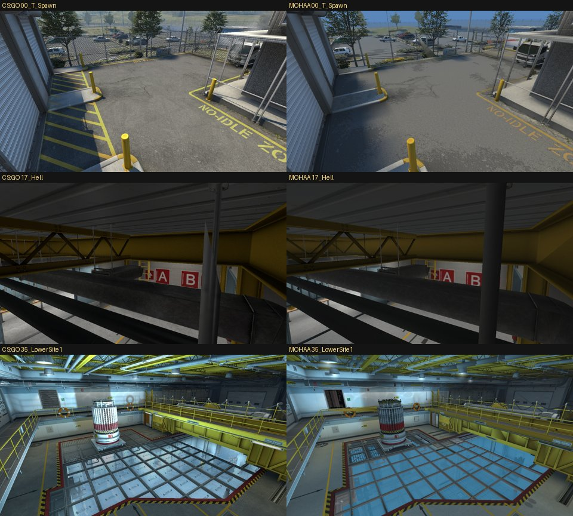
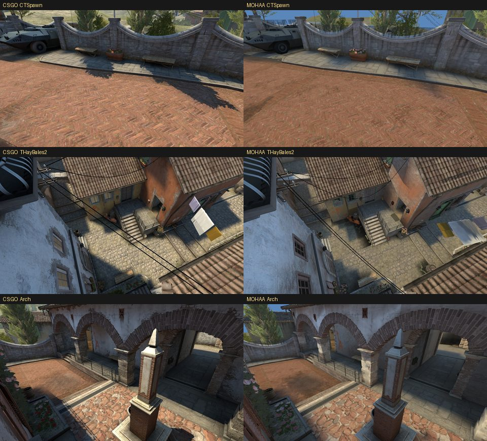
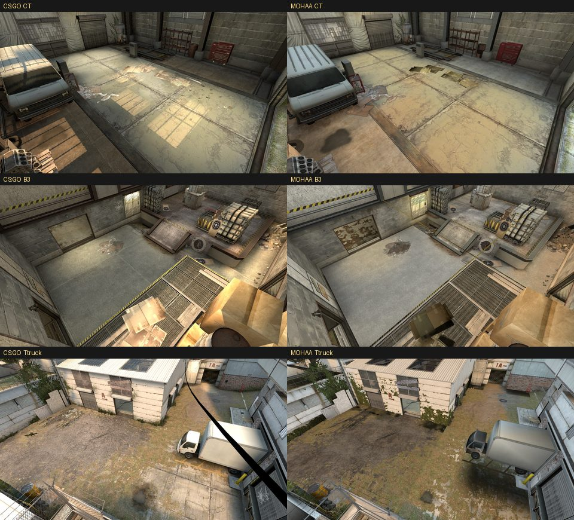
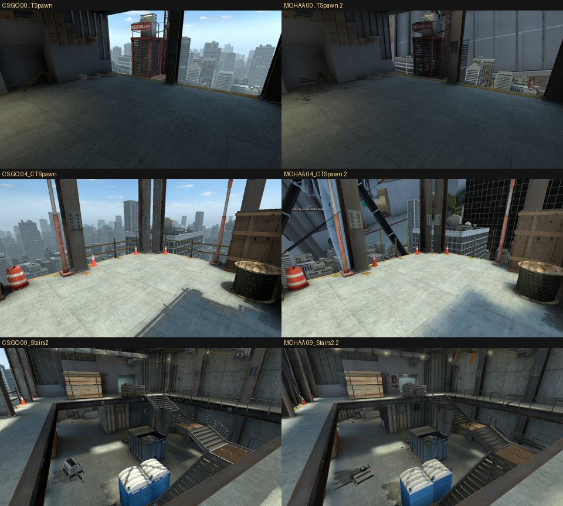
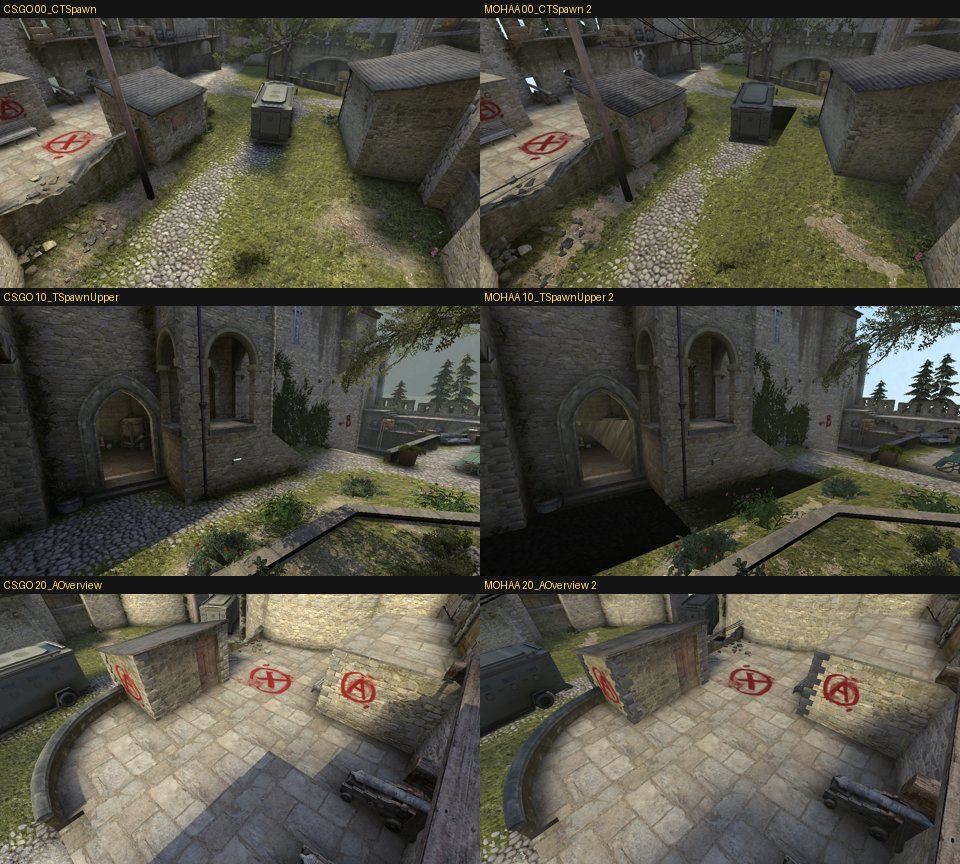

# moh-maps

Tools and knowledge for making **Medal of Honor: Allied Assault / OpenMoHAA**
multiplayer maps, built so an AI agent (or you) can make any map, bug-free:

1. **convert CS:GO maps** to MOHAA;
2. **create maps from scratch**: invented, described in words, or recreated
   from a screenshot.

Every map goes from idea to a tested, playable `.pk3` in one automated loop.



*`maps/mk_village`, written entirely in Python with mohkit.* Below: a room from
stock mohdm1 recreated from one screenshot (reference, recreation, blend; see
[docs/from-reference.md](docs/from-reference.md)).



```text
maps/<name>/build.py ──▶ .map ──EA Q3map/VIS/MOHlight──▶ .bsp ──▶ .pk3 ──OpenMoHAA──▶ screenshots + bot match
```

## What's here

- **`mohkit/`**, the toolkit:
  - `.map` and BSP v19 read/write;
  - map authoring (`Carver`: describe the playable air, get a sealed,
    textured, caulked hull; `kit`: stairs, window/door niches, roofs, trims,
    lamps; stock props with collision data);
  - validation and top-down plans;
  - a driver for EA's original compilers (native or through Wine/CrossOver);
  - automated OpenMoHAA runs (scripted cameras, clean screenshots, bot
    matches, log triage);
  - a retail asset catalog;
  - CS:GO readers (VPK, VTF, VMT, BSP, MDL) and a CS:GO → MOHAA converter.
- **`docs/`**, a verified knowledge base: design rules, the `.map` format,
  compiler flags and errors, entities, lighting recipes, materials, scripting,
  testing, CS:GO conversion, engine facts with source citations. Start at
  [docs/README.md](docs/README.md).
- **`maps/`**, map projects. [`mk_village`](maps/mk_village) is a Normandy
  crossroads DM map written entirely in Python (squares, streets, a two-storey
  town hall, house, warehouse, stock props, gable roofs).
  [`mk_ref_room`](maps/mk_ref_room) is a room rebuilt from a single screenshot.
- **`reference/`**, the stock EA `.map` sources (Allied Assault, Spearhead,
  Breakthrough) plus a few community maps: the best examples of how real MOHAA
  maps are built.
- **`data/`**, catalogs generated from those sources: every material with
  size, scale and usage; every entity key; every stock prop with bounds and
  collision; the lighting of every MP map.

## Quick start

```sh
python3 -m venv .venv && .venv/bin/pip install pillow numpy
.venv/bin/python -m mohkit setup                    # fetch the EA compilers (MOHTools) into .toolchain/
.venv/bin/python -m mohkit doctor                   # finds your game, OpenMoHAA, Wine
.venv/bin/python -m mohkit build maps/mk_village -q draft
open dist/mk_village_shots.png
.venv/bin/python -m mohkit install dist/mk_village.pk3   # then: g_gametype 1; map dm/mk_village
```

Requirements: a retail Allied Assault install (the compilers need its shader
scripts), OpenMoHAA for testing, Wine or CrossOver off Windows, Python ≥ 3.10.

CS:GO conversion (local use only, since it decodes Valve's textures):

```sh
.venv/bin/python -m mohkit csgo de_dust2 --name cs_dust2
```

## For AI agents

Read [CLAUDE.md](CLAUDE.md) (other agents: [AGENTS.md](AGENTS.md)).

## Legal

Map sources in `reference/` are EA's released SDK sources. The EA compilers are
downloaded separately, not stored here. Nothing derived from Valve content
(textures, models, converted BSPs) is committed. Converter output goes to
`local/` (gitignored) and is for personal use.

## CS:GO conversions side by side

Each pair below is the same camera (CS:GO's own named spectator viewpoints, same position
and angles; CS:GO draws them at fov 90, the MOHAA shots at 80, so the right image is a little
narrower): left, CS:GO itself (`python -m mohkit csgo-ref`); right, the
converted map in OpenMoHAA. The converted maps use CS:GO's own baked lighting and an exposure
fitted to these screenshots (`--fit-exposure`). Converted maps and their assets stay local
(personal use); only these screenshots are in the repo.

| map | brightness error vs CS:GO (0-255, all cameras) | ladders climbable | bot kills (8 bots, 90 s) | fps mean / worst camera (before -> now) |
|---|---|---|---|---|
| de_dust2 | 4.9 | none | 87 | 206 / 99 -> 305 / 193 |
| de_mirage | 4.1 | 3/3 | 72 | 199 / 64 -> 342 / 168 |
| de_nuke | 5.6 | 6/6 | 78 | 39 / 22 -> 98 / 64 |
| de_inferno | 6.4 | none | 26 | 82 / 27 -> 229 / 141 |
| de_cache | 9.6 | 1/1 | 28 | 174 / 67 -> 308 / 239 |
| de_vertigo | 10.7 | 3/3 | 48 | 153 / 82 -> 235 / 178 |
| de_cbble | 4.8 | 2/2 | 47 | 93 / 40 -> 229 / 141 |

fps: OpenMoHAA on an Apple M4, 1280x720, retail high detail, `r_primitives 2`, at every
camera (`python -m mohkit csgo <map> --perf 2000`); "before" is the build installed until
2026-10-01 evening, "now" adds prop LOD and CS:GO's prop fade distances. Keep
`seta r_primitives "2"` in your config: on macOS the default draws these maps about 10x slower.

What still differs is mostly the engine: MOHAA has no bump maps, specular highlights,
reflections or bloom, so surfaces look flatter. Only de_vertigo keeps CS:GO's 3D skybox (its
city, drawn as a portal sky); the other maps show the 2D sky where CS:GO shows distant scenery.
Details: `docs/csgo-conversion.md`.

### de_dust2


### de_mirage


### de_nuke


### de_inferno


### de_cache


### de_vertigo


### de_cbble

