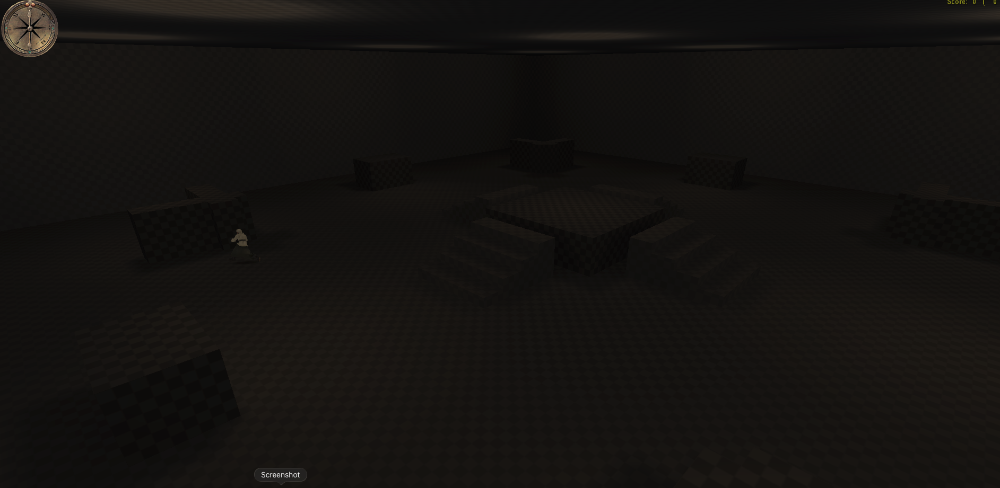

# MoHAA/OpenMoHAA map generation notes

Living research document — revision 5, 2026-07-24

## Maintenance rule

This is the canonical living knowledge file for the map-generation work. Every
map iteration must update it with new format discoveries, compiler behavior,
runtime results, visual defects, fixes, and reusable production rules. A map
change is not complete until the corresponding knowledge has been recorded
here.

## Goal and current result

The immediate target is a compiled Medal of Honor: Allied Assault deathmatch
map that also plays under OpenMoHAA and is easy for its bots to navigate.

That target is now technically proven. `codex_arena01` was generated as text,
compiled with the original Allied Assault Q3map/VIS/MOHlight tools, loaded by
OpenMoHAA 0.82.1, and accepted by OpenMoHAA's automatic Recast navigation
builder.

That path has now produced both an original gray-box arena and a much larger
Dust II brush-layout study using stock Allied Assault materials and props.

## Sources inspected

| Source | Revision inspected | What it contributed |
| --- | --- | --- |
| [pstngh/moh-maps](https://github.com/pstngh/moh-maps) | `7e336eb37814b52417c91d700138a305c020bb4c` | Stock AA, Spearhead, and Breakthrough `.map` source corpus |
| [openmoh/openmohaa](https://github.com/openmoh/openmohaa) | `a2f340195975f4f042e28a60b62561dd9a0b2700` | BSP constants/loader, map-tool parser, scripts, runtime, and bot navigation |
| [pstngh/netradiant-custom](https://github.com/pstngh/netradiant-custom) | `10165e88d118c97c4cd430e396f27fa759ac8b9f` | Modern Radiant editor and generic Q3map2 brush/patch implementation |
| [pstngh/MOHTools](https://github.com/pstngh/MOHTools) | `dd050da3d5981a53e904b67f079255e762ac0e94` | MoHRadiant, the actual AA compilers, stock AA sources, and EA multiplayer templates |

The NetRadiant source is useful for understanding how a Radiant-family editor
represents and manipulates convex brushes and patches. Its Q3map2 game list
does not currently include a MoHAA profile, so it is not a drop-in replacement
for the MoHAA compiler. MOHTools was the missing practical bridge.

## End-to-end mental model

```text
Radiant or generator
        |
        v
text .map + scripts + source art
        |
        | Q3map BSP stage
        v
.bsp + .prt + .vis helper
        |
        | Q3map -vis
        v
visibility data
        |
        | MOHlight
        v
lit AA BSP (visibility/lightmaps/lightgrid embedded)
        |
        | ZIP with .pk3 extension
        v
main/maps/dm/<name>.bsp
main/maps/dm/<name>.scr
main/maps/dm/<name>_precache.scr
textures/scripts/models used by the map
        |
        v
MoHAA/OpenMoHAA runtime
        |
        v
OpenMoHAA generates Recast navigation for custom maps at load time
```

The `.map` is editable source. The `.bsp` is the playable compiled level.
The sidecar `.prt` and `.vis` files are build artifacts and do not belong in
the runtime `.pk3`.

## Text `.map` grammar

### Entities

A map is a sequence of top-level entity blocks. The first entity is
`worldspawn`; it owns the static world brushes, patches, and terrain.

```text
{
"classname" "worldspawn"
"message" "Example"
"ambientlight" "18 18 20"
{
    ...brush faces...
}
}
{
"classname" "info_player_deathmatch"
"origin" "256 128 32"
"angle" "180"
}
```

Entity properties are quoted string pairs. Point entities usually need a
`classname` and `origin`; many also use `angle`, `target`, `targetname`,
`spawnflags`, or class-specific values.

### Convex brushes

A normal brush is a nested block of plane definitions. One face line has:

```text
( p1x p1y p1z ) ( p2x p2y p2z ) ( p3x p3y p3z )
texture/name shiftX shiftY rotation scaleX scaleY content surface value
```

Whitespace/newlines are flexible. The three points define an oriented plane;
point order selects the solid half-space. A valid brush is the convex
intersection of all its planes. Reversing a face can turn the solid inside out,
so generator code should use tested face-winding helpers rather than improvised
point order.

MoHAA maps can append per-face extensions such as:

```text
surfaceColor r g b
+surfaceparm name
-surfaceparm name
subdivisions n
surfaceDensity n
```

The final three numeric fields and these extensions affect contents, surface
behavior, tessellation, and lighting. Plain `0 0 0` faces are sufficient for
ordinary solid gray-box geometry.

### Patches

Curved surfaces use a `patchDef2` block. It identifies a texture, dimensions,
and a rectangular control-point grid. Each control point contains world
coordinates and texture coordinates:

```text
{
patchDef2
{
texture/name
( width height 0 0 0 )
(
    ( ( x y z s t ) ... )
    ...
)
}
}
```

Patches are useful for arches, pipes, trims, and smooth curved façades, but
collision and bot movement usually need separate simple brushwork.

### Terrain

MoHAA's `terrainDef` is a game-specific height/texture cell structure rather
than merely another brush. It is common in outdoor SH/BT work and present in
several AA maps. The old `ommap` source in OpenMoHAA explicitly skips
`terrainDef`: its comment says the MoHAA syntax is incompatible with the
inherited Q3map terrain parser. This is a strong reason to use the original
Q3map/MOHlight tools for compatibility.

Terrain is not necessary for the first generation system. Reliable convex
brushes are enough for indoor arenas, courtyards, streets, stairs, ramps, and
most cover.

## Multiplayer entities and scripts

The EA multiplayer notes shipped in MOHTools establish the minimum:

- `info_player_deathmatch` is used by free-for-all deathmatch.
- `info_player_allied` and `info_player_axis` are required for team modes.
- `info_player_start` is the spectator/team-selection start.
- DM/TDM files belong under `maps/dm`; objective files belong under `maps/obj`.
- The map needs a same-named `.scr` and `<name>_precache.scr`.
- A basic multiplayer precache script executes `global/DMprecache.scr`.

For a reusable simple DM generator I include all three multiplayer spawn
classes. This makes the same geometry usable in free-for-all and team modes.
Spawn origins must be above the floor, clear of solids, separated from cover,
and preferably aimed toward useful space.

A minimal map script is:

```text
main:

setcvar "g_obj_alliedtext1" "Map title"
setcvar "g_obj_alliedtext2" ""
setcvar "g_obj_alliedtext3" ""
setcvar "g_obj_axistext1" ""
setcvar "g_obj_axistext2" ""
setcvar "g_obj_axistext3" ""

level waittill prespawn
exec global/DMprecache.scr
level.script = maps/dm/example.scr
level waittill spawn

end
```

and the precache file is:

```text
exec global/DMprecache.scr
```

The stock game supplies `global/DMprecache.scr`, player models, state files,
weapons, sounds, and other standard runtime data.

## What the stock corpus shows

Counts below come from a structural parser written during this study. They are
useful as scale references, not quality targets.

| Game | Map | Entities | Brushes | Faces | Patches | Terrains | DM / Allied / Axis spawns | Lights |
| --- | --- | ---: | ---: | ---: | ---: | ---: | --- | ---: |
| AA | `mohdm1` | 608 | 3,034 | 18,179 | 120 | 0 | 18 / 22 / 20 | 156 |
| AA | `mohdm2` | 241 | 2,993 | 17,513 | 0 | 5 | 18 / 12 / 12 | 60 |
| AA | `mohdm6` | 636 | 2,325 | 13,957 | 68 | 2 | 25 / 25 / 25 | 293 |
| AA | `mohdm7` | 1,009 | 5,556 | 33,225 | 534 | 1 | 18 / 18 / 18 | 463 |
| SH | `MP_Bazaar_DM` | 239 | 1,642 | 12,323 | 368 | 15 | 21 / 8 / 7 | 61 |
| SH | `MP_Gewitter_DM` | 803 | 4,737 | 37,070 | 28 | 78 | 17 / 23 / 20 | 259 |
| SH | `MP_Holland_DM` | 429 | 6,215 | 48,093 | 179 | 146 | 19 / 15 / 12 | 0 |
| BT | `mp_brest_dm` | 174 | 2,997 | 23,132 | 111 | 61 | 11 / 11 / 11 | 26 |
| BT | `mp_stadt_dm` | 427 | 4,026 | 31,298 | 280 | 9 | 23 / 12 / 12 | 57 |
| BT | `mp_verschneit_dm` | 438 | 5,644 | 40,486 | 130 | 0 | 15 / 9 / 8 | 197 |

Practical observations:

- Stock maps commonly provide roughly 11–25 neutral DM spawns.
- Team-spawn counts do not have to equal neutral-spawn counts.
- AA already uses brushes, patches, and terrain; the expansions lean heavily
  into large patch and terrain counts but do not introduce a wholly different
  authoring language.
- `common/caulk` and `common/nodraw` are heavily used to suppress invisible
  faces. Expansion maps also make extensive use of dedicated player/metal/wood
  clipping materials.
- Some SH maps in the BT source corpus are byte-identical, useful evidence
  that the basic source representation remains shared.

## Reusing the `obj_team2` stock palette

The preferred visual direction for the next AA map is the V2
industrial/bunker material family used by `obj_team2`. A custom map can
reference these stock shader names directly; the texture images and shader
scripts remain in the player's retail AA PK3s and do not need to be copied into
the custom map package.

Useful visible materials include:

| Purpose | Stock material candidates |
| --- | --- |
| Bunker walls | `general_structure/bunker_wall`, `normandy/bunker_conc3` |
| Concrete | `general_structure/jh_conc512b`, `mohcommon/jeff-concrete-walla`, `mohcommon/jeff-concrete-wallb` |
| Solid floors/steps | `algiers/whsflrset1_1b`, `algiers/doccrtset_1stepsml` |
| Metal deck/grates | `general_industrial/deckgrate_set1a`, `general_industrial/deckgrate_set1b` |
| Ceiling | `normandy/bunk_ceiling` |
| Iron panels | `das_boot/ironwall1`, `german/rusty_iron` |
| Structural trim | `general_structure/beam_wood1`, `mohcommon/ibeam_1a`, `general_industrial/verticalbrace` |
| Utility detail | `general_industrial/utilitybox_side`, `general_industrial/utilitybox_front`, `general_industrial/utilboxtop` |

Invisible brush faces should use `common/caulk`; purpose-built collision can
use `common/clip`, `common/playerclip`, `common/metalclip`, or
`common/stoneclip` as appropriate. This both matches stock construction
practice and avoids rendering hidden surfaces.

`obj_team2` also uses stock `static//lightbulb_caged.tik` lamps,
`static//corona_orange.tik` coronas, warm `_color "1.0 0.9 0.8"` lights, and
substantial explicit light placement. Those stock models can be referenced
without bundling them, but the light entities still need to be compiled into
the map. The next generator revision should support per-face materials so
grates, walls, floors, ceilings, and hidden sides are assigned deliberately
rather than applying one texture to every side of a box.

## AA BSP/runtime format

OpenMoHAA's `qfiles.h` records:

- little-endian BSP identifier `2015`;
- AA BSP version `19`;
- supported historical range `17` through `21`, with `21` labeled
  Breakthrough;
- 28 named BSP lumps;
- 128×128 lightmaps;
- major limits such as 32,768 brushes, 131,072 draw surfaces, and 524,288
  draw vertices.

The generated BSP begins:

```text
32 30 31 35 13 00 00 00 ...
```

That is ASCII `2015` followed by little-endian version `19`.

Important lumps include shaders, planes, lightmaps, surfaces, draw vertices and
indices, leaves/nodes, brush sides/brushes, models, entities, visibility,
lightgrid data, sphere lights, terrain, and static models.

## Compiler recipe

For `gameRoot\main\maps\dm\example.map`:

```powershell
Q3map.exe -gamedir "gameRoot" -moddir main "gameRoot\main\maps\dm\example.map"
Q3map.exe -vis -fast -gamedir "gameRoot" -moddir main "gameRoot\main\maps\dm\example.map"
MOHlight.exe -gamedir "gameRoot" -moddir main "gameRoot\main\maps\dm\example.map"
```

The first stage creates the BSP tree and portal data. The second calculates
potential visibility. MOHlight writes lightmaps, grids, and entity lighting
back into the BSP. `-fast` is useful for light-preview iterations; the
distributed prototype uses the full light pass.

Compiler warnings must be interpreted by stage:

- A leak means the playable void is connected to the outside; fix it before
  relying on VIS or lighting.
- Invalid or degenerate brushes indicate generator geometry/winding bugs.
- Missing textures can still compile but will render incorrectly.
- Complexity limits should be monitored with the compiler's info output.

The official compiler reported the prototype at about 0.25 MB, comfortably
under its 10 MB guidance.

## OpenMoHAA bots and navigation

OpenMoHAA 0.82.x generates Recast navigation for custom maps at runtime.
Legacy navigation files cover stock maps and can be selected with
`g_navigation_legacy 1`, but generated custom maps do not need a hand-authored
legacy nav file.

Geometry still determines whether the resulting mesh is useful. A bot-focused
generator should favor:

- broad stairs/ramps and landings;
- simple convex floors;
- adequate headroom and lane width;
- cover that does not form one-way pockets;
- no thin sliver brushes;
- connected circulation routes;
- spawn clearance from walls and obstacles.

The prototype uses four 224-unit-wide stairways, 24-unit rises, open lanes, and
simple rectangular cover. The headless runtime log reached:

```text
CM_LoadMap( maps/dm/codex_arena01.bsp, 0 )
Server Initialization Complete
Building the navigation mesh...
Recast navigation mesh(es) generated in 0.084 seconds
```

The isolated test server then attempted to add bots and stopped on missing
retail `american_army` model/state assets. That is expected because the test
directory intentionally contained OpenMoHAA plus this map, not the copyrighted
retail PK3s. It proved map loading and navigation generation independently of
the later full-data playtest.

## Prototype specification and validation

`codex_arena01` contains:

- a sealed 2,560×2,560×512-unit indoor arena;
- 35 static world brushes and 210 source faces;
- a 96-unit central platform with four broad stairways;
- 12 low cover elements forming two circulating lanes;
- 16 neutral, 8 Allied, and 8 Axis spawns;
- one spectator start;
- nine warm point lights plus low ambient light;
- four original procedural 128×128 TGA textures;
- no retail map geometry, textures, models, or sounds.

Verified results:

- BSP, VIS, and full MOHlight stages completed successfully.
- No leak, invalid-plane, or degenerate-brush error was reported.
- Final BSP size: 273,332 bytes.
- Final BSP SHA-256:
  `2201CECC40796973B84B75C56F443C46305DC7480411FEB8C889A0886BCA83ED`.
- OpenMoHAA 0.82.1 loaded the map and generated Recast navigation.
- A second clean test loaded the map and scripts from the seven-file `.pk3`
  alone, with no loose map copy masking packaging errors.
- A user playtest with the full game data rendered the arena and showed a bot
  walking through it, confirming installed-PK3 loading, textures, spawning, and
  practical navigation.

### First in-game visual result



The geometry reads as intended: the central platform, four stairs, perimeter
cover, and circulating floor lanes are all present. The procedural checker
textures are rendering rather than falling back to a missing-texture material.

The main issue is illumination. Ambient `18 18 20`, nine lights at intensity
`500`, dark source textures, and a broad enclosed room produce insufficient
contrast. The next gray-box pass should raise ambient light, strengthen and
lower the point lights, and brighten the base materials. The ceiling also
occupies a large dark band at the top of the view, so raising it or giving it
brighter surface treatment would improve spatial readability.

## Packaging

A `.pk3` is a ZIP archive with a different extension. The prototype contains:

```text
maps/dm/codex_arena01.bsp
maps/dm/codex_arena01.scr
maps/dm/codex_arena01_precache.scr
textures/codex/floor.tga
textures/codex/wall.tga
textures/codex/trim.tga
textures/codex/ceiling.tga
```

ZIP entry names should use forward slashes even when the archive is built on
Windows. The supplied build script writes the archive through the .NET ZIP API
instead of PowerShell's `Compress-Archive`, whose Windows entry names use
backslashes.

Install it in the game's `main` folder and launch:

```text
g_gametype 1
map dm/codex_arena01
```

For OpenMoHAA bots:

```text
sv_maxbots 8
sv_numbots 4
map dm/codex_arena01
```

## Compatibility and licensing boundaries

The prototype is compiled as an AA version-19 BSP and uses only basic AA
entity/script conventions. It should therefore be the safest common target for
original AA and OpenMoHAA.

The original EA AA executable was not available in the isolated validation
directory, so that binary was not launched. Original-AA compatibility is based
on the original AA compiler and version-19 format; OpenMoHAA was directly
runtime-tested.

The official EA tools are licensed for use with Medal of Honor: Allied Assault
and are not redistributed in the deliverables. The stock `.map` corpus was used
as format/reference material. Original EA map geometry and art should not be
copied into generated maps without a clear right to redistribute them.

The prototype's map geometry, generator, and procedural textures are newly
created. The retail game remains necessary for its standard multiplayer
scripts and game assets.

## What remains before calling the prototype polished

1. Walk every spawn and stair; look for snagging, z-fighting, texture
   stretching, excessive darkness, and sightline problems.
2. Run several bot counts and watch for navigation stalls or dominant loops.
3. Correct the underlighting and reevaluate player/cover silhouette contrast.
4. Adjust cover and spawn visibility based on combat behavior.
5. Add a theme, richer materials, soundscape, loading image, and scoreboard art
   only after the gray-box plays well.

## Dust II to V2 translation study

The second generated map tests whether the pipeline can preserve a documented
layout rather than inventing a small arena. Dust II was selected because its
route structure is recognizable, its scale is suitable for multiplayer bots,
and an editor-format VMF could be parsed as a geometric measurement source.

The reference contained 973 world solids and 1,093 entities. Including entity
brushes, it represented 2,281 solids, 14,462 sides, 69 displacement-bearing
sides, 20 Terrorist starts, and 20 Counter-Terrorist starts. The converter:

- preserved the original brush planes for the playable world and detail solids;
- skipped editor-only clips, hints, triggers, areaportals, and helper volumes;
- removed the distant Source 3D skybox;
- replaced Source displacements and selected prop cover with simple brushes;
- mapped every material to a stock MoHAA texture family;
- translated the Source sky shell to AA's real `sky/mohday1` shader;
- emitted 20 Axis, 20 Allied, and 40 neutral DM spawn entities;
- retained useful point lights and added evenly distributed fill lighting.

The corrected AA map contains 2,294 world brushes and 165 entities. Q3map
produced a version-19 BSP, fast VIS processed 599 clusters and 1,913 portals,
and MOHlight lit 38 stock static models. OpenMoHAA loaded the packaged map,
generated its Recast navigation mesh, and accepted two bots into the battle in
a full-data server smoke test.

This is a measured brush-layout translation, not a byte-identical CS2 port.
Source and Allied Assault use different BSP capabilities, collision behavior,
props, displacements, lighting, and player movement. The current CS2 release
also distributes a compiled `de_dust2.vmap_c`, not the editable source VMF used
by this experiment. The source VMF and all Valve art assets are excluded from
the deliverables. The playable package contains only the compiled MoHAA BSP and
scripts and uses stock MoHAA materials/models at runtime.

### Visual-correctness repair after the first playtest

The first Dust II package passed structural compile, load, and navigation tests
but failed visually. A user screenshot showed a black sky, large black voids,
and architecture that appeared to float.

The root cause was the compile environment rather than absent source brushes.
The BSP had been built against an isolated staging root without the retail
`Pak0.pk3` shader scripts. Q3map therefore gave named materials default flags:
`common/caulk` was not treated like stock caulk and the sky substitute was not
a sky shader. At runtime, hidden-face treatment and the sky no longer agreed
with what the compiler had encoded, exposing black gaps even though the
corresponding Source sky shell and brush geometry were present.

Correct production rule:

1. Generate source anywhere convenient.
2. Run Q3map, VIS, and MOHlight with `-gamedir` pointing to a real retail AA
   installation containing its normal `main/Pak0.pk3` data.
3. Package only the generated BSP and scripts; do not redistribute retail PK3s.

The repair also:

- maps Source sky directly to `sky/mohday1`;
- gives exposed Source nodraw faces a visible stock masonry fallback when they
  belong to an otherwise visible brush;
- reserves `common/caulk` for faces and collision brushes that are genuinely
  safe to hide;
- restores recognizable silhouette detail with 163 generated decor brushes;
- substitutes 38 stock AA props: eight palms, six rusted cars, one wagon, and
  scaled buckets/cans;
- lowers and strengthens fill lighting while retaining warm V2-style color;
- narrows prop matching so car parts do not become whole cars and milk cartons
  do not become full-size buckets.

The final compile reported no leak or invalid-brush error. An in-engine
live-player screenshot confirmed a rendered sky, continuous floors and walls,
lit routes, stock vehicles, cover, and architectural detail. The dark
triangular region seen from the first repaired spectator camera was verified
from a player spawn to be a lower route in perspective, not a missing surface.

### Second Dust II playtest: displacement and prop-origin defects

A six-screenshot bot playtest exposed defects that the initial spawn-area
visual check did not cover:

- crates and rusted cars floated above their intended floors;
- all eight substituted palms were suspended above the skyline;
- a group of large layered slabs blocked a route;
- several ground areas showed overlapping triangular strips and z-fighting;
- isolated black floor gaps remained near displaced terrain;
- rectangular masonry patches appeared where hidden Source faces should be.

The VMF analysis confirmed 68 retained world solids with displacement faces.
Copying those solids as ordinary AA brushes exposes the displacement support
volume rather than the deformed Source surface. Mapping every mixed-solid
nodraw face to visible masonry made those support sides and other hidden faces
visible, producing the slab piles, triangular slivers, and rectangular wall
patches.

The prop defects come from incompatible model origins:

- Dust crate origins are at their vertical centers; generated boxes must start
  at `origin.z - height / 2`.
- Source vehicle origins sit roughly 28 units above the ground, while the stock
  AA rusted-car model expects a ground-level origin.
- `palm_tree_trunk.mdl` origins are approximately 536 units above the ground
  because the Source trunk model extends downward from its origin. A complete
  stock AA palm uses a root origin and therefore needs that offset removed.
- Most Source cans and buckets are tipped clutter objects. Replacing them with
  upright AA buckets loses their orientation and should be omitted.

The corrective conversion rule is to rebuild each displacement face as a thin
convex slab extruded into the original solid, render only its outer face, and
caulk the inner and edge faces. Regular Source nodraw/helper faces can return to
real `common/caulk` now that every compile uses the retail shader scripts.

### Corrected-build validation

Revision 5 implemented the rule for all 61 playable displacement faces. The
generator emitted 2,289 world brushes and 142 entities, skipped no retained
displacement, omitted 28 unsupported/tipped clutter props, and retained 15
stock models (eight palms, six rusted cars, and one wagon). Generated crates
are now bottom-aligned from their center origins; cars are lowered 28 units;
and Source palm-trunk replacements are lowered 536 units.

The retail-data compile completed without a leak or invalid-brush error. Q3map
reduced 7,388 input faces to 6,905, fast VIS processed 633 clusters, 2,003
portals, and 2,490 faces with 550 clusters visible on average, and MOHlight lit
all 15 retained models. The final BSP is 4,971,888 bytes with SHA-256
`2CF6FBEA7D8B97282E0AA1A4F80B258529409A1FEF03C011E9DDFC12FB6D8B73`.
The packaged PK3 is 937,829 bytes with SHA-256
`645D437B108CDD5CE41892BB42F0A3775D8915DA4BC5B50F0EEBB2132C645667`.

An exact-package OpenMoHAA 0.82.1 dedicated test loaded the three-file PK3,
built Recast navigation in 0.839 seconds, and admitted two bots into the
battle. The bot server requires both `sv_maxbots` and `sv_numbots`; `addbot`
cannot increase the count when `sv_maxbots` remains at its default zero.

Automated visual-QA note: OpenMoHAA's `wait` command advances one command
buffer frame and ignores a numeric count, so timed capture configs need
repeated `wait` lines. The `tele` and `face` player events require the latched
`cheats` cvar. A failed cheat/teleport sweep can still write screenshots from
the unchanged spawn and must not be counted as coverage of the requested
coordinates. The successful ordinary-spawn capture showed continuous
caulk-corrected surfaces and grounded palms, while the displacement and
prop-origin repairs above were validated structurally and through compile and
runtime checks; the next human playtest remains the decisive visual check for
all six reported viewpoints.

### Third Dust II playtest: why thin base-plane slabs are insufficient

An eight-screenshot follow-up confirmed that center-aligned crates now rest on
the ground, but it also exposed major regressions:

- broad bright/sky-colored gaps appeared below walls and across missing terrain;
- the replacement displacement planes overlapped into layered ramps and ridges;
- generated dome stand-ins floated above the map in large clusters;
- at least one rusted-car substitute was buried deeply in an intact floor;
- black rectangular surfaces and unsealed openings remained in several routes.

The earlier fixed `-28` car-origin correction was based on an incorrect visual
inference: missing terrain below the first cars made them appear suspended.
Where an intact floor is visible, subtracting 28 units places the AA car below
the surface. The stock model should retain the Source car origin; only its
simple collision brush should extend downward around the wheels.

The larger regression proves that a Source displacement's undeformed support
face cannot stand in for its rendered surface, even when that face is extruded
as a thin slab. The `dispinfo` block stores a `(2^power + 1)` square vertex
grid. Each rendered vertex starts at a bilinear point on the original face and
then applies its stored offset plus `normal * distance`. Correct conversion
therefore requires tessellating that final grid and emitting the resulting
triangles as thin AA detail prisms. Using only the four base corners discards
the terrain shape, creates overlap between neighboring supports, and exposes
the bright world outside through the missing displaced surface.

The dome and antenna brush approximations are decorative rather than
gameplay-significant. Their Source placement depends on the original model
bounds and on roof geometry that may itself be displaced or model-based.
When that support is not reproduced exactly, a fabricated cylinder stack
becomes conspicuous floating geometry. These stand-ins should be omitted until
their support surface can be proven.

### Fourth Dust II repair: joined patch meshes, not micro-brushes

Reconstructing all displacement grid points fixed the missing terrain shape,
but representing its 6,944 grid triangles as individual eight-unit brush
prisms was not stable in the Allied Assault Q3map compiler. In-engine
wireframe and lightmap diagnostics proved that the remaining black polygons
were absent faces, not dark lightmaps or texture defects. Texturing the
perimeter sides did not help. Giving every triangle a local extrusion normal
made the gaps larger because adjacent solid prisms no longer shared the same
back volume.

The reliable representation is a set of joined `patchDef2` surfaces:

1. Reconstruct each VMF point as `bilinearBase + offset + normal * distance`.
2. Divide each odd-sized displacement grid into overlapping 3x3 control
   patches, advancing two samples per patch.
3. Reuse all three control points on every shared patch edge.
4. Determine playable-side winding from the original Source solid center.
5. Reverse the patch columns when the mathematical
   `cross(columnAdvance, rowAdvance)` normal points toward playable air,
   because MOHAA/Q3 patch draw winding uses the opposite visible side.

For the Dust II reference, this converts 61 displacement faces into 868 joined
patches while preserving the 6,944 source-grid triangle samples. Q3's patch
interpolation is quadratic, whereas Source renders a linear triangle grid, so
this is not byte-identical topology. It is visually continuous, collision is
present, and it avoids both the flat-support regression and the micro-brush
seams.

The final corrected build contains 2,171 ordinary world brushes, 868 patches,
and 142 entities. Q3map reduced 7,216 input brush faces to 6,725 in 28 seconds
with no leak or invalid-brush error. Fast VIS processed 602 clusters, 1,898
portals, and 2,344 faces with 549 clusters visible on average. MOHlight lit all
15 retained stock models in 17 seconds. It emitted four non-fatal
`potential hash mismatch` warnings while lighting curved patches.

OpenMoHAA 0.82.1 loaded 5,857 brush faces and all 868 meshes. The automated
player-spawn screenshot showed a continuous, lit, walkable floor without any
of the former black triangular holes. The test also confirmed that Source car
Z origins should be retained, crates should remain bottom-aligned, palms need
the measured -536 root correction, and unsupported dome/antenna stand-ins
should stay omitted.

The exact final three-file PK3 also passed a dedicated-server bot smoke test:
OpenMoHAA parsed the BSP in 0.040 seconds, generated Recast navigation in 0.884
seconds, and admitted `bot1` and `bot2`.

Revision 6 artifact fingerprints:

- BSP: 4,956,168 bytes, SHA-256
  `BBA2E073D632E10BA4794E017135CDE989886B9749800BA664A0576979F352E4`
- PK3: 1,003,791 bytes, SHA-256
  `BCEBCE2B542CAFD7EA32EC2C04512DDF2F5D95787B112443DC93A065B683B44C`

### Fifth Dust II playtest: quadratic terrain and missing facade props

Eleven follow-up screenshots (`shot0015` through `shot0025`) show that revision
6 removed the triangular terrain holes, but three defect classes remain:

- rock-wall displacements bow into oversized curtain-like ridges because raw
  VMF samples were used directly as quadratic Bezier control points;
- all six AA rusted-car substitutions remain about one Source-origin offset
  above the ground, and the larger AA silhouette collides visually with nearby
  crate substitutions;
- dozens of Source window facade models were omitted, leaving stark black or
  sky-colored rectangles in otherwise solid masonry.

A quadratic Bezier span does not pass through its middle control point. Using
three consecutive Source displacement samples as a 3x3 patch therefore changes
the measured terrain even though the patch edges meet. The better translation
is to preserve every Source sample as a Bezier endpoint and insert arithmetic
midpoints between adjacent samples. A 9x9 Source grid becomes a 17x17 patch;
each individual Source cell is then a bilinear span with no overshoot. This
also reduces the Dust II terrain from 868 separately lit patches to one joined
patch per retained displacement face.

The facade analysis also explains many apparent world holes. The reference
contains 27 `du_window_bridge` props, 13 `du_window_palace` props, and dozens
of dimension-named Dust window/shutter variants. Their surrounding wall
brushes were retained but the models themselves were skipped. Simple inset
stock-wood panels, oriented from each prop yaw and sized from the encoded
window dimensions, are a safer AA fallback than exposing the outside of the
map. Unsupported stone teeth, baskets, and loose stone-block stand-ins should
be omitted until their Source bounds are reproduced.

The final repair lowers level AA car replacements by 28 units and omits the
two Source cars whose pitch or roll exceeds five degrees. A static AA model
entity retains yaw but cannot reproduce those cars' steep compound tilt; the
previous upright substitutions therefore floated and overlapped nearby
geometry. Four level cars remain.

The corrected build contains 2,218 ordinary world brushes, 61 midpoint-
expanded terrain patches, 112 facade panels, and 140 entities. Q3map emitted
6,185 brush faces from 6,676 input faces with no leak or invalid-brush error.
Fast VIS processed 602 clusters, 1,898 portals, and 2,344 faces, with 549
clusters visible on average. MOHlight lit all 13 retained stock models. Its
old patch-lighting path emitted 22 non-fatal `potential hash mismatch`
warnings.

OpenMoHAA 0.82.1 loaded the exact final PK3 with 6,124 brush faces and 61
meshes, generated Recast navigation in 1.689 seconds, and ran four bots that
successfully navigated and killed one another. The runtime screenshot showed
a continuous floor and stock-wood backing panels in openings that were
previously black.

Revision 7 artifact fingerprints:

- BSP: 5,212,212 bytes, SHA-256
  `67F75242F7B3897088C48DE78FE2231046DE090CCB99D4812DFBE4295B616780`
- PK3: 1,252,297 bytes, SHA-256
  `B18E5C6466ABD7C19B742CF835DA0D48DDE76AE931724CB339BAD21D0C9A5A17`

### Sixth Dust II playtest: displacement backings and layered facades

Eleven more screenshots (`shot0000` through `shot0010`) confirm that revision 7
made the terrain continuous and restored active bot combat. They also reveal
the next visual defects:

- the terrain and rock-wall perimeter can still expose black void or brightly
  shaded undersides because the converter emitted only the displacement skin;
- `normandy` concrete is a poor substitute for Dust's rough rock boundary;
- one oversized replacement panel makes the missing facade models obvious,
  while a small panel alone leaves cream or black gaps around the opening;
- the revision 7 car correction buries the AA car's wheels.

A Source displacement belongs to a solid. Reconstructing only its displaced
face loses the brush volume behind the skin, including the side and bottom
surfaces that close the world wherever the terrain perimeter is visible. The
revision 8 converter therefore emits the 61 joined midpoint-expanded patches
and restores the 60 original displacement-bearing brush hulls behind them. The
displaced base plane is caulked; exposed helper-only perimeter faces use the
same visible material as the displacement. This keeps the accurate patch
surface while sealing its underside and boundary.

Facade repair works better as two independent visual layers. The generator now
places a large, two-unit-thick `general_structure/bunker_wall` backing across
each of the 112 missing model footprints, then adds a smaller four-unit-thick
`central_europe/shutter_set2` decorative face. Both are non-solid. The large
neutral backing closes the unwanted black/cream field without turning the
entire opening into a giant wooden shutter, while the modest shutter retains
the architectural cue. Keeping these visual replacements non-solid preserves
the routes generated from the Source brush layout; eight-bot runtime testing
confirmed traversal and combat.

The rough terrain boundary now uses `wilderness/wldrrckset1_1`, a stock texture
family already used by `obj_team2`. This matches the requested AA asset palette
more closely than bunker concrete.

Direct engine inspection corrected another model-origin assumption. The
revision 7 `-28` Z adjustment buries the wheels of the AA rusted-car model. A
retail `obj_team4` placement also keeps this model's entity origin roughly 28
units above its contact floor, proving that the raised origin is part of the
model contract rather than a Source offset that should be removed. Revision 8
retains the Source Z for the four level cars and continues to omit the two
steeply tilted cars that an upright AA static model cannot reproduce.

Compilation should use a clean retail-only game root. Compiling the same source
against a mod-heavy installation exhausted the old MOHTools surface table with
`MAX_SURFACE_INFO`; hardlinking only retail Pak0 through Pak6 into a staging
root removed the unrelated shader/surface pressure and produced a valid build.

The revision 8 generator emits 2,330 ordinary world-brush records, 61 terrain
patches, 112 facade backings, 112 decorative shutter panels, and 140 entities.
Q3map emitted 6,801 brush faces from 7,316 input faces with no leak or invalid
brush. Fast VIS processed 599 clusters, 1,913 portals, and 2,326 faces, with 547
clusters visible on average. MOHlight lit all 13 retained stock models and
reported 22 non-fatal `potential hash mismatch` warnings.

OpenMoHAA 0.82.1 loaded the exact PK3 with 6,740 brush faces and 61 meshes,
generated Recast navigation in 2.265 seconds, and ran eight bots that navigated
and killed one another.

Revision 8 artifact fingerprints:

- BSP: 5,565,188 bytes, SHA-256
  `A82B29231DEC86668ABEADE559F1D0B85A716076997106EF91BFD97D6C7063B5`
- PK3: 1,303,606 bytes, SHA-256
  `51604126DEFE362D6E3E2A0E407306622D32BCE29CFA1D26B47CDABF8E3826BB`

### Seventh Dust II playtest: boundary skirts and grade-snapped cars

Seven more screenshots (`shot0011` through `shot0017`) confirm that the
revision 8 layered facade treatment fixed the empty windows. They also isolate
two remaining conversion errors:

- cars whose Source origins are about 24 to 29 units above their local grade
  still visibly float;
- displacement edges can leave large black wall bands and smaller triangular
  wedges even though both the displaced patch and original support hull are
  present.

The second defect is a boundary-connectivity problem. A Source displacement
starts on a solid face, but its stored offsets and distances can move any
perimeter sample away from that face's undeformed edge. Restoring the original
brush hull closes the volume behind the base plane; it does not fill the space
between a moved patch perimeter and the base perimeter. That explains both the
large missing-wall-looking spans in `shot0012` through `shot0014` and the
smaller black rock wedges in `shot0015` and `shot0016`.

Revision 9 emits a material-matched quadratic patch skirt along each moved
boundary. Every skirt has three control rows: the reconstructed displaced
edge, arithmetic midpoint controls, and the original base edge. Long edges are
split at the same maximum eight-Source-cell span used by the main surface.
Winding is selected relative to the original solid center so the playable side
is visible. Edges whose displaced and base samples are effectively identical
are omitted. The 61 measured displacement surfaces require 235 skirts, adding
3,480 sealing triangles and bringing the runtime terrain total to 296 meshes.

The first skirt compile also exposed a legacy syntax rule that square patches
had hidden: AA Q3map interprets the first `patchDef2` dimension as the number
of row records and the second as the number of points in each row. A rectangular
skirt written as `(17 3)` while supplying three row records fails parsing; the
correct declaration for those records is `(3 17)`. Generators should treat the
dimension pair as `(rows columns)`, regardless of conventions used by other
Q3-family tools.

Direct inspection of retail `models/static/vehicle_car_rusted.tik` corrects
the revision 8 car-origin inference. Its Quaked bounds are
`(-128 -56 0) (128 48 96)`, and its collision maps also bottom out at model
Z=0. The entity origin is therefore the contact plane. Retaining Source car Z
values of `27.91`, `28.91`, `24`, and `144` necessarily suspends the AA
replacement. Revision 9 snaps a retained car to the nearest 64-unit grade when
it is within 32 units, producing Z values `0`, `0`, `0`, and `128`. It
preserves the small Source pitch, yaw, and roll through the entity `angles`
key and starts the extra caulk collision volume at the same grounded Z. The
two cars tilted by more than five degrees remain omitted.

The revision 9 generator emits 2,330 ordinary world-brush records, 61
midpoint-expanded terrain surfaces, 235 boundary skirts, 112 facade backings,
112 decorative shutter panels, and 140 entities. Q3map emitted 7,036 brush
faces from 7,551 input faces with no leak or invalid brush. Fast VIS processed
599 clusters, 1,913 portals, and 2,326 faces, with 547 clusters visible on
average. MOHlight lit all 13 retained stock models and reported 58 non-fatal
`potential hash mismatch` warnings from its old curved-patch lighting path.

OpenMoHAA 0.82.1 loaded the exact package with 6,740 brush faces and all 296
meshes and stitched 92 patch LoD cracks. It generated Recast navigation in
3.339 seconds in the first visual run and 3.309 seconds in the final
clean-retail package run, then ran eight bots. The bots traversed the map and
killed one another; eight automated viewpoints rendered lit, continuous
geometry on the sampled routes without the former black boundary bands.

Revision 9 artifact fingerprints:

- BSP: 6,213,732 bytes, SHA-256
  `47FB6DDED8B3A458B6867CCF53563D24575CB5F995AB435F08E760C03D3CE447`
- PK3: 1,546,408 bytes, SHA-256
  `7E0AD4C676091D192458F0EB2B305BEA0B0870F20F9B70221BAE1A18A8F640DD`
- source ZIP: 450,472 bytes, SHA-256
  `1EBCE36B4A5534EC36C4DFB479E7199D0CAB252CF7B1209E7954CFFD44589601`

### Lighting study: stock AA and Breakthrough's Monte Cassino

The revision 9 Dust II lighting is structurally wrong even though it is no
longer black. Its generator sets `ambientlight` to `15 15 16`, `ambient` to
`42`, `suncolor` to `92 84 68`, and adds 20 warm spawn-area fill lights at
550 intensity. It also clamps every retained Source point light to at least
450. Those large omnidirectional fills flatten surfaces, tint the whole level
tan, and erase the directional contrast that makes stock Medal of Honor maps
read well.

Stock AA maps do not require one fixed lighting recipe, and `obj_team2` should
be treated only as a useful data point rather than a target to copy. Across the
ten retail AA multiplayer sources, median point-light intensities are generally
between 5 and 80. `obj_team2` has 181 point lights with median 80 and average
88; `obj_team4` has 176 with median 50 and average 56.8. The AA sources also
prove that `sundiffuse`, `sundiffusecolor`, `farplane_color`, and low global
ambient values are valid AA techniques.

The user's Breakthrough reference is almost certainly
`mp_montecassino_tow.map`, whose worldspawn message is `Monte Cassino`. Its
distinctive outdoor look is produced by separation of lighting roles:

- warm direct sun: `suncolor "100 60 20"`;
- cool sky fill: `sundiffusecolor "70 70 90"` with `sundiffuse "1.1"`;
- low neutral/cool floor: `ambientlight "8 8 10"`;
- dark violet atmospheric distance:
  `farplane_color ".036 .024 .036"` at `farplane "4000"`;
- a dedicated `ep2sky/cassino` sky material;
- 291 local point lights whose median is only 15 and average is 61.6. Of
  those, 224 are intensity 20 or lower. Three exceptional 2500-intensity
  lights exist, but they are special accents rather than the baseline.

The transferable lesson is the warm-sun/cool-shadow relationship, low ambient,
restrained fixture lights, and a sky/farplane palette designed as part of the
same scene. Dust II should receive its own AA-compatible profile rather than
copying either Monte Cassino or `obj_team2`: clear Mediterranean daylight,
cream-to-neutral direct sun, slightly cool diffuse fill, visible but not black
shadows, mild distance haze, and warm local lights only where an actual
fixture or interior requires them. Spawn-following fill lights should be
removed. Retained Source lights should be selected by purpose and translated
into the normal AA intensity range instead of being globally clamped to 450.

Breakthrough-only sky assets must not be referenced by an AA package unless
they are intentionally redistributed. The underlying worldspawn techniques
are nevertheless AA-compatible because the same keys appear in retail AA map
sources. The safe approach is to use an AA sky (or a new bundled sky) and
reproduce the lighting composition with the AA compiler. Lighting changes
should be compiled as an isolated visual revision and playtested at outdoor
lanes, deep interiors, transitions, and player-model visibility before any
geometry changes are mixed in.

### Dust II revision 10: original Mediterranean daylight

Revision 10 applies the lighting study without changing geometry, props,
spawns, or collision. The worldspawn now uses:

```text
ambientlight     8 9 11
suncolor         135 116 88
sundirection     325 225 0
sundiffusecolor  58 66 84
sundiffuse       1.15
_color           1.0 0.94 0.84
farplane         8000
farplane_color   0.43 0.45 0.48
```

This is an original clear Mediterranean profile rather than a copy of V2,
`obj_team2`, or Monte Cassino. The sun is cream rather than orange, while the
diffuse and ambient components are cooler so shadows separate from the warm
surfaces. The blue-gray farplane coordinates distance haze with the sky
without importing a Breakthrough-only sky asset.

The converter deletes the loop that placed a 550-intensity point light over
every second multiplayer spawn. It retains all 25 real Source `light` and
`light_spot` entities, but maps Source brightness `b` to
`clamp(b * 0.9 + 15, 10, 200)` and adds `overbright_range 0.2`. In the current
playable bounds that produces 25 AA point lights from 24 to 150 intensity,
with median 60 and average 72.4. Their original colors and origins remain
intact. The conversion report consequently drops from 140 to 120 entities and
records zero fill lights.

Two in-engine bakes were useful. The first used `ambientlight "6 7 9"` and a
weaker `clamp(b * 0.55 + 10, 10, 180)` fixture translation. It immediately
removed the former tan wash and restored directional outdoor shading, but an
automated tunnel viewpoint was too close to black. Raising ambient to
`8 9 11` and strengthening only the real fixtures made that interior readable
without reintroducing global or spawn-following fill. This illustrates why
lighting QA must sample both the attractive courtyard view and the least-lit
playable route.

The final isolated build retained the revision 9 geometry counts. Q3map emitted
7,036 faces from 7,551 inputs without a leak or invalid brush. Fast VIS
processed 599 clusters, 1,913 portals, and 2,326 faces, with 547 clusters
visible on average. MOHlight lit all 13 stock models and emitted the same 58
non-fatal curved-patch hash warnings as revision 9.

OpenMoHAA 0.82.1 loaded the exact final PK3 with 6,740 faces and 296 meshes,
generated Recast navigation in 3.171 seconds, and ran eight bots that traversed
and killed one another. The final eight-viewpoint run sampled sunlit
courtyards, shadowed lanes, indoor/outdoor transitions, and the darkest
retained-fixture tunnel. Player silhouettes and surface shapes remained
readable while interiors stayed intentionally darker than outdoor routes.

Revision 10 artifact fingerprints:

- BSP: 6,111,568 bytes, SHA-256
  `05E0F1E96B2ABA73F2326330A42F6CD3D30D19599E6BB44E039925AA994CE442`
- PK3: 1,550,872 bytes, SHA-256
  `9B113BC0A20B26A2DFD7E89AAC56AA87712E76B37FBA2D9246968EE43686DDA9`
- source ZIP: 450,874 bytes, SHA-256
  `347B86765F960DB98F98C5CD674C03E1D6903D52CB351F2ECD30B417FB3A2A0E`

## Cobblestone conversion: choosing the tractable CS reference

The decompiled CSGO references make Cobblestone the better next target than
Cache. The measured VMFs differ substantially:

| Measurement | Cache | Cobblestone |
| --- | ---: | ---: |
| File size | 45,755,859 bytes | 12,794,064 bytes |
| World solids | 13,227 | 3,047 |
| Total solids | 16,508 | 5,841 |
| Sides | 99,612 | 37,344 |
| Displacements | 10,952 | 854 |
| Entities | 7,643 | 4,229 |
| Prop instances | 4,170 | 1,246 |
| Unique prop models | 647 | 135 |
| Unique materials | 154 | 75 |

Cobblestone is not small by AA standards, but it has roughly one quarter of
Cache's world brushes and fewer than one tenth as many displacements. It also
maps naturally onto stock AA stone, timber, roof, cobble, grass, door,
shutter, and vegetation assets.

### Reading ordinary BSPSource displacement data

The Cobblestone VMF established that BSPSource does not always write
`vertices_plus`, and an ordinary decompiled `dispinfo` block may omit
`offsets`. A converter must therefore:

1. intersect the convex backing brush's planes to recover its vertices;
2. select the four vertices lying on the displacement side;
3. order the quad from `startposition`;
4. treat missing offsets as zero vectors;
5. combine the bilinear base point, per-sample offset, and
   `normal * distance`;
6. reverse patch columns when the generated draw side faces into the backing
   solid.

That reconstruction succeeded for 839 of 840 candidate sides in the full
experimental mode; one degenerate surface had no usable normal. It produced
839 visible surface patches. Restricting boundary skirts to traversable
terrain reduced skirt meshes from 2,273 to 1,231 without removing roof or
timber surfaces.

The geometry was nevertheless impractical for the original compiler. A
3,112-patch build and a reduced 2,070-patch build each spent ten minutes in
Q3map without completing. This is a compiler-scale limit rather than invalid
VMF data. The reproducible generator retains the curved implementation behind
`--full-displacements`, while its default first-playable mode renders and
collides against the original planar backing brushes.

### Q3 portal limits and the structural-shell solution

A planar 2,721-brush import compiled its geometry quickly but failed while
loading portals:

```text
LoadPortals: NumVisBytes 2406176 exceeds 2097152
```

Disabling 1024-unit block chopping increased the failed portal data to
2,726,120 bytes. A large Source layout cannot let every imported wall and trim
become a structural Q3 split plane.

The working conversion encloses the playable bounds in six structural
`sky/mohday1` brushes and flags imported interior geometry as detail. Detail
brushes retain collision and lightmapped surfaces but do not recursively
partition visibility. This reduced the final VIS problem to 90 clusters, 161
portals, and 1,448 bytes of visibility data.

Importing none of the original `func_detail` solids compiled in 126 seconds,
but engine QA showed conspicuously absent building sections. Importing all
2,735 caused Q3map to exceed a ten-minute bound. Bounding-box volume was a
useful first-pass fidelity heuristic:

- below 4,096 cubic units: 364 solids;
- 4,096–16,383: 454;
- 16,384–65,535: 696;
- 65,536–262,143: 561;
- 262,144–1,048,575: 347;
- at least 1,048,576: 313.

The selected baseline omits the 1,514 solids below 65,536 cubic units and
keeps 1,221 larger `func_detail` solids. Q3map completed this 3,938-brush map
in 323 seconds, emitting 18,610 faces from 19,998 inputs. The threshold is a
practical initial-build policy, not an art rule: later revisions should bring
back selected long/thin façade elements by material, model context, or visible
importance instead of reducing the threshold globally.

### Cobblestone first-playable content and validation

The first compiled revision uses only AA-native assets. Its prop translation
creates non-solid stone arch/port frames, shutter/door/grate façade panels,
upright barrel cylinders, hay/coffin/crate cover, and a reduced set of stock
trees and bushes. The conversion report records:

- 3,140 converted source solids and 840 planarized displacement brushes;
- 44 neutral DM spawns, 22 Axis spawns, and 22 Allied spawns;
- 65 translated Source fixture lights and no spawn-following fills;
- 123 cover brushes, 193 arch or port replacements, and 90 façade panels;
- 26 stock trees and 48 stock bushes;
- 1,128 helper-only brushes and 18 distant-skybox brushes omitted.

Lighting follows the warm-direct/cool-fill lesson from the Dust study:
`ambientlight "9 10 12"`, `suncolor "112 101 84"`,
`sundiffusecolor "58 65 78"`, and `sundiffuse "1.2"`. Source fixtures are
translated with `clamp(b * 0.9 + 15, 10, 200)` and
`overbright_range "0.2"`. Full MOHlight completed in 239 seconds.

OpenMoHAA 0.82.1 loaded the exact final PK3. An initial QA mistake showed that
`bot_enable` alone does not create bots: the engine requires `sv_maxbots` and
`sv_numbots`. With both set to eight, bots spawned, moved, fought, traversed
outdoor grades, and used interior corridors. Eight followed-player
screenshots confirmed coherent castle walls, roofs, vegetation, exterior and
interior lighting, and working player collision. Known first-revision visual
debt remains: planar rather than sculpted terrain, omitted thin trim, and a
small number of floating or incomplete façade/prop fragments.

Artifact fingerprints:

- BSP: 14,511,848 bytes, SHA-256
  `8C7404BA4C21B45906D623208845AB7C498BF96662CCA39A4F8F953F9DF3AA7C`
- PK3: 2,857,786 bytes, SHA-256
  `C3F0455695E71001948743348C86659033D43512DA6899CDB8BDC3C517A50E7E`
- source ZIP: 312,239 bytes, SHA-256
  `BE57F404A38607406E8D9FCC504AF4BE967D89CD490F1DEB9A4A601542586DA4`

### Cobblestone revision 2: restore thin architecture

The first user playtest supplied four screenshots that exposed a systematic
failure rather than unrelated local bugs:

- large exterior wall areas opened directly to sky;
- window, door, arch, and port replacements floated without supporting walls;
- interior floors and ceilings ended abruptly;
- bridge and passage shells contained bright holes.

The cause was revision 1's bounding-box volume filter. A small-volume Source
`func_detail` solid is not necessarily cosmetic: wall skins, floor plates, and
ceiling slabs can have a large visible area but very little thickness. Leaving
their attached prop replacements in place made the failure especially
conspicuous.

Revision 2 removes the filter and retains all 2,735 `func_detail` solids. The
structural six-brush sky shell remains essential: all 4,653 imported source
solids are detail geometry, so restoring them increases compile time and face
count without returning to the 2 MiB portal overflow. Q3map completed the
5,471-brush final map in 731 seconds, emitting 25,873 faces from 27,605 inputs.
Fast VIS remained at 90 clusters. Full MOHlight completed in 388 seconds.

Cobblestone also uses modular castle models as architecture. Placement
measurement showed that `port_a` and `port_b` instances repeat at 256-unit
intervals, while `port_sect_a` repeats at roughly 128 units. The earlier
universal 112-unit approximation left rows of unsupported uprights. Revision
2 uses non-solid 256-unit major port modules, 128-unit port sections,
32-to-48-unit depth, and heavier stone surrounds. Fourteen omitted
`arch_g_pillar` instances now receive generated stone pillars. These visual
modules do not change navigation collision.

The final conversion report records 5,471 generated brushes, 4,653 converted
source solids, 840 planarized displacement backing brushes, 195 arch/port
modules, 137 cover brushes, and zero skipped detail solids. The package still
uses 44 neutral DM spawns, 22 Axis spawns, 22 Allied spawns, 65 translated
fixture lights, and 74 stock vegetation entities.

Two eight-bot OpenMoHAA runs were inspected. The first proved that complete
detail import restored continuous walls, floors, ceilings, and interior
shells. The second validated the measured port widths. Bots spawned, moved,
fought, and traversed both interior and exterior routes. Remaining fidelity
debt is now narrower: planar rather than sculpted displacement terrain and
some simplified distant arcades whose original surfaces exist only in Source
model files, not VMF brush data.

Revision 2 artifact fingerprints:

- BSP: 18,722,768 bytes, SHA-256
  `89A9FD5A42C0D3F4E998455A609764E9EA75080C66358AC6865FB768ADAE23F9`
- PK3: 3,694,818 bytes, SHA-256
  `B63199BB5A044D9ADA1A21F665D819DF899CBDA200EE722745806E97A15E99C5`
- source ZIP: 441,353 bytes, SHA-256
  `B1B9F5ABEE8933564EBF082E2797B0F66065B41128E17C128AB7DDAB5F6EFC87`

## Next generation-system steps

- Separate topology from theme so one layout can receive multiple material and
  prop sets.
- Add deterministic seeds and a JSON layout manifest.
- Add brush validation before compile: bounds, minimum thickness, plane
  orientation, spawn-to-solid tests, and sealed-world checks.
- Parse compiler output and fail automatically on leaks or invalid brushes.
- Add optional patch-based arches while retaining simple brush collision.
- Add a headless runtime smoke test and record navigation-build success.
- Generate several small layouts—courtyard, warehouse, and compact streets—and
  compare bot heat/traffic before spending time on final art.

## External references

- [OpenMoHAA repository](https://github.com/openmoh/openmohaa)
- [OpenMoHAA bot/configuration documentation](https://docs.openmohaa.org/md_docs_2markdown_203-configuration_201-configuration.html)
- [Valve Map Format displacement documentation](https://developer.valvesoftware.com/wiki/VMF_%28Valve_Map_Format%29#Dispinfo)
- [pstngh/moh-maps](https://github.com/pstngh/moh-maps)
- [pstngh/netradiant-custom](https://github.com/pstngh/netradiant-custom)
- [pstngh/MOHTools](https://github.com/pstngh/MOHTools)
- [MoHAA basic compile tutorial](https://mohaaaa.co.uk/mohaa/tutorials/basic_compile.php)
- [EA Allied Assault level editor archive page](https://www.moddb.com/games/medal-of-honor-allied-assault/downloads/moa-allied-assault-level-editor)

## Revision log

- 2026-07-24, revision 1: repository study, source-format model, corpus counts,
  first generator, successful AA compile, OpenMoHAA load, and Recast navigation
  smoke test.
- 2026-07-24, revision 2: full-data user playtest confirmed rendering, bot
  spawning, and traversal; recorded the first visual findings and underlighting
  correction target.
- 2026-07-24, revision 3: measured Dust II brush-layout translator, V2/stock
  material remap, final BSP/VIS/light compile, 40 neutral DM spawns, and
  successful OpenMoHAA Recast navigation generation.
- 2026-07-24, revision 4: diagnosed the black-void playtest failure, required
  retail shader data during compile, restored real sky and stock props, refined
  lighting/material fallbacks, and added in-engine visual QA.
- 2026-07-24, revision 5: analyzed the six-screenshot extended playtest,
  implemented thin-slab reconstruction for 61 playable displacement faces,
  restored real caulk, grounded or omitted incompatible prop substitutions,
  rebuilt the final PK3, and validated exact-package Recast navigation with two
  bots.
- 2026-07-24, revision 6: analyzed the eight-screenshot regression, corrected
  the car-origin inference, reconstructed every VMF displacement grid, proved
  that touching triangle prisms lose faces in AA Q3map, replaced them with 868
  joined and correctly wound patch meshes, omitted unsupported rooftop
  stand-ins, and verified continuous terrain in OpenMoHAA.
- 2026-07-25, revision 7: analyzed eleven additional screenshots, replaced raw
  quadratic patch controls with midpoint-expanded bilinear spans, reduced the
  terrain to 61 continuous meshes, backed 112 omitted facade-window props,
  grounded level car substitutions, omitted incompatible tilted cars and
  clutter, and validated the exact PK3 with four fighting OpenMoHAA bots.
- 2026-07-25, revision 8: analyzed eleven additional screenshots, restored 60
  displacement support hulls, layered 112 non-solid facade backings with 112
  decorative shutters, corrected the rock material and car Z placement, used a
  clean retail compile root, and validated the exact PK3 with eight fighting
  OpenMoHAA bots.
- 2026-07-25, revision 9: analyzed seven additional screenshots, sealed all
  moved displacement boundaries with 235 material-matched patch skirts,
  corrected rectangular AA patch dimension ordering, grade-snapped four rusted
  cars from verified retail TIKI bounds, and validated 296 meshes with eight
  fighting OpenMoHAA bots and eight automated viewpoints.
- 2026-07-25, lighting study: diagnosed revision 9's oversized global and
  spawn-fill lights, compared the retail AA multiplayer corpus, identified the
  Breakthrough reference as Monte Cassino, and recorded an original
  AA-compatible warm-sun/cool-fill direction for the next Dust II lighting
  build.
- 2026-07-25, revision 10: replaced the tan-wash lighting with an original
  warm-sun/cool-fill Mediterranean profile, removed all 20 spawn-following
  lights, translated 25 real Source fixtures into the AA intensity range,
  iterated against two eight-viewpoint OpenMoHAA runs, and validated the exact
  final PK3 with eight fighting bots.
- 2026-07-25, Cobblestone revision 1: measured Cache versus Cobblestone and
  selected the smaller reference; added ordinary BSPSource displacement
  reconstruction; diagnosed patch-time and 2 MiB portal limits; introduced a
  structural sky shell, planar displacement baseline, and volume-selected
  detail import; compiled 18,610 faces; and validated the exact final package
  with eight fighting OpenMoHAA bots across eight followed-player viewpoints.
- 2026-07-26, Cobblestone revision 2: diagnosed four user screenshots as a
  thin-architecture filtering failure; restored all 2,735 `func_detail`
  solids; measured and widened modular port replacements; added missing stone
  pillars; compiled 25,873 faces; and validated continuous interior/exterior
  architecture with two eight-bot OpenMoHAA runs.
